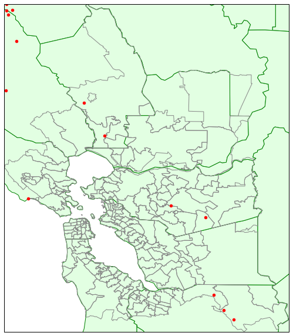

# Attempts at Python 3.x + GIS work with pyshp, osgeo, matplotlib.basemap

Learning about Python and GIS as I go...

Attempting to do everything in Python 3.x, [as supplied by Anaconda](https://docs.continuum.io/anaconda/pkg-docs).

# Current status 

## Libraries I have successfully used

I've been able to install these libraries and use them on OSX and Python 3.5, via the Anaconda installer:

- [fiona](https://github.com/Toblerity/Fiona) - friendly API for handling of different shapefile formats.
- [shapely](http://toblerity.org/shapely/manual.html) - geospatial analysis
- [descartes](https://pypi.python.org/pypi/descartes) - converts geometric objects into paths and patches for Matplotlib.
- [geopandas](http://geopandas.org) - wraps up the above libraries with Pandas DataFrames
- [basemap](http://matplotlib.org/basemap/index.html)  - Matplotlib's geographic mapping library

## Plotting data on maps

Trying to use [matplotlib's basemap](https://github.com/matplotlib/basemap) to do geospatial visualizations.

- [x] Installed basemap via `conda install basemap`
- [x] Created earthquake scatterplot on Earth map layer: [gist](https://gist.github.com/dannguyen/eb1c4e70565d8cb82d63)

    
- [x] Rendered mapviz as part of matplotlib grids [viz_subplotmaps.py](viz_subplotmaps.py)
    
    

## Plotting shapefiles

- [ ] Use basemap to read shapefile and project
  - [x] Successfully plotted Census shapefile that's already in epsg:4326
    
    
    Check it out: [plot_census_counties.py](plot_census_counties.py)

      

  - [x] Plot shapefiles that aren't in lat/lng format by first using [Geopandas to reproject to esri:4326](notebooks/Geopandas%20on%20OS%20X%20and%20Anaconda%20+%20Python 3.5.ipynb)
    
    

### Using pyshp

Trying to re-project a shapefile in Python using [pyshp](https://pypi.python.org/pypi/pyshp):

- [x] Installed pyshp `pip install pyshp`
- [x] Attempted to emulate example: [Reproject a Polygon Shapefile using PyShp and PyProj](https://glenbambrick.com/2016/01/24/reproject-shapefile/)

### Using pyproj

Projecting coordinates with [pyproj](https://github.com/jswhit/pyproj)

- [x] Installed pyproj via `conda install pyproj`
- [x] Successfully projected coordinates
  - See use of pyproj to translate X/Y coordinates in NYPD stops-and-frisks data to lng/lat: [dannguyen/python-notebooks-data-wrangling -- wrangling-nypd-frisks.py](https://github.com/dannguyen/python-notebooks-data-wrangling/blob/master/scripts/wrangling-nypd-frisks.py)
  - See early attempts at using pyproj (and caveat about its configuration): [Getting inaccurate results converting from New York State projection to NAD83 with Python's pyproj](http://gis.stackexchange.com/questions/181667/getting-inaccurate-results-converting-from-new-york-state-projection-to-nad83-wi)   

### Other tutorials to look at later:

- https://www.pfenninger.org/posts/mapping-the-worlds-nuclear-power-plants/
